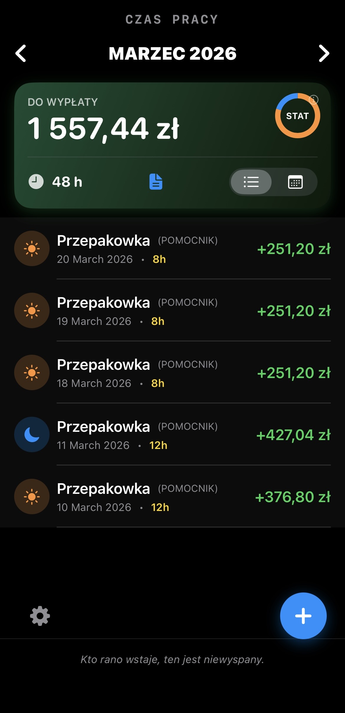
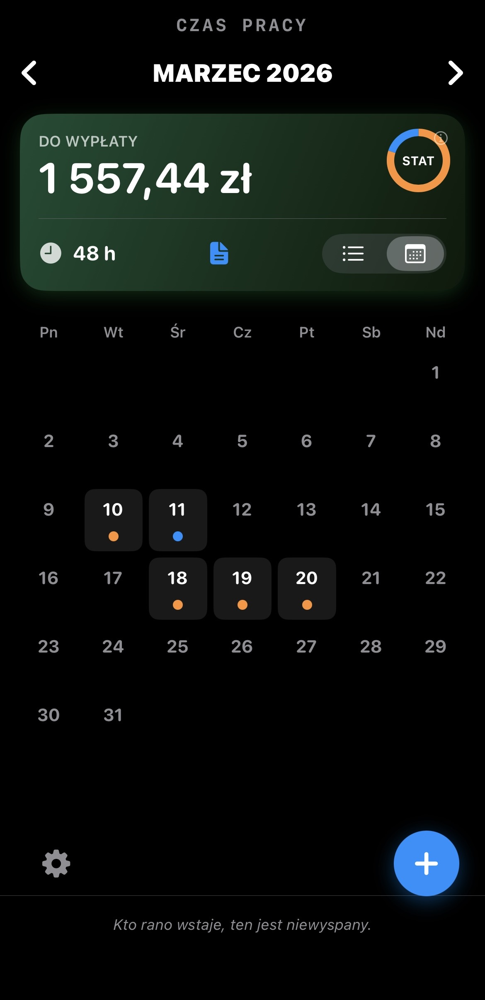
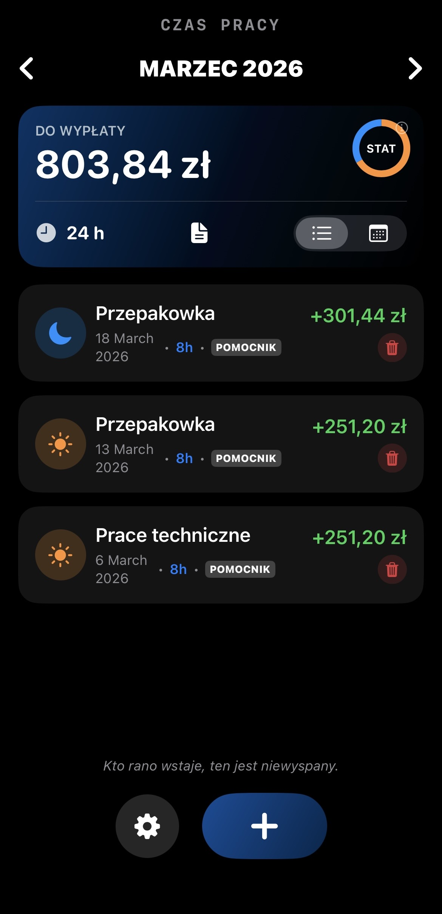
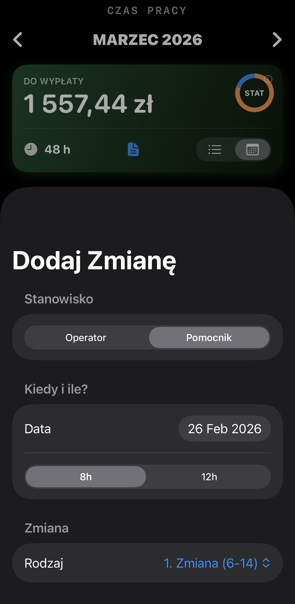

# 🏭 KołchozTime - Shift Work Manager

**KołchozTime** is a modern iOS application developed in **SwiftUI**, designed to streamline shift management and salary forecasting for shift workers. The application addresses the complexity of calculating earnings with variable rates (day/night, operator/helper roles) and shift durations (8h/12h).

    
    
    
    

## 🚀 Key Features

* **Smart Contextual Calendar:** Rapid shift entry via direct interaction with the calendar grid. The app intelligently detects whether to edit an existing shift or add a new one based on the selected date.
* **Dynamic Role & Rate System:** Full support for distinct hourly rates based on job roles (**Operator / Helper**) and time of day (**Base Rate / Night Shift**).
* **Real-time Analytics:** Visual breakdown of shift types using interactive charts and instant salary calculation updated in real-time.
* **Flexible Reporting:** Generation of detailed text reports with customizable granularity (option to include or hide specific job roles) and seamless integration with the iOS Share Sheet.
* **Motivation Engine:** A humorous "Manager" quote system to improve user engagement.

## 🛠 Technology Stack

* **Language:** Swift 5
* **UI Framework:** SwiftUI
* **Architecture:** MVVM (Model-View-ViewModel)
* **Data Persistence:** UserDefaults
* **Version Control:** Git & GitHub

## 📂 Project Structure

The project follows a clean **MVVM** architecture for better maintainability and separation of concerns:

* `Models/`: Contains data structures (`WorkShift`, `JobRole`, `ShiftType`).
* `ViewModels/`: Handles business logic, salary calculations, and data transformation (`AppViewModel`).
* `Views/`: SwiftUI views divided into components (`CalendarView`, `AddShiftView`, `SettingsView`, `Components`).

## 📲 How to Run

1.  Clone this repository.
2.  Open `KolchozTime.xcodeproj` in **Xcode 16+**.
3.  Select your target simulator or physical device.
4.  Press **Cmd + R** to build and run.

## 🔮 Future Roadmap

* [ ] Data export/import (Backup system).
* [ ] Monthly earnings target visualization.
* [ ] Intelligent task suggestion based on user history.
* [ ] Push notifications for shift logging reminders.

---

**Author:** aarbuz
