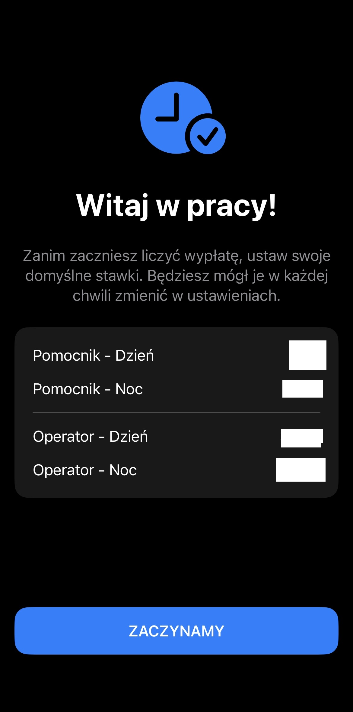
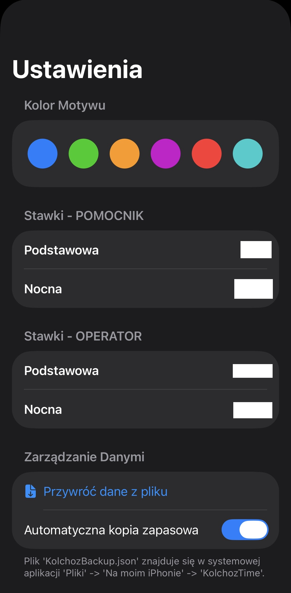

# 🏭 KołchozTime - Manager Pracy Zmianowej

**KołchozTime** to nowoczesna aplikacja na system iOS stworzona w **SwiftUI**, zaprojektowana w celu usprawnienia zarządzania grafikami i prognozowania wynagrodzeń dla pracowników zmianowych. Aplikacja rozwiązuje problem złożonych obliczeń zarobków przy zmiennych stawkach (dzień/noc, role operatora/pomocnika) i różnych czasach trwania zmian (8h/12h).

  
  
  
  

## 🚀 Kluczowe Funkcje

* **Inteligentny Kalendarz Kontekstowy:** Szybkie wprowadzanie zmian poprzez bezpośrednią interakcję z siatką kalendarza. Aplikacja inteligentnie rozpoznaje, czy edytować istniejącą zmianę, czy dodać nową na podstawie wybranej daty.
* **Dynamiczny System Ról i Stawek:** Pełne wsparcie dla różnych stawek godzinowych w zależności od pełnionej roli (**Operator / Pomocnik**) oraz pory dnia (**Stawka Podstawowa / Nocna**).
* **Analityka w Czasie Rzeczywistym:** Wizualny podział typów zmian za pomocą interaktywnych wykresów oraz natychmiastowe kalkulacje wynagrodzenia aktualizowane na bieżąco.
* **Elastyczne Raportowanie:** Generowanie szczegółowych raportów tekstowych z możliwością dostosowania poziomu szczegółowości (opcja ukrywania konkretnych ról) i płynna integracja z systemowym arkuszem udostępniania iOS (Share Sheet).
* **Silnik Motywacyjny:** System humorystycznych cytatów "Kierownika", który zwiększa zaangażowanie użytkownika.

## 🛠 Stos Technologiczny

* **Język:** Swift 5
* **UI Framework:** SwiftUI
* **Architektura:** MVVM (Model-View-ViewModel)
* **Przechowywanie Danych:** UserDefaults
* **Kontrola Wersji:** Git & GitHub

## 📂 Struktura Projektu

Projekt opiera się na czystej architekturze **MVVM**, co zapewnia łatwiejsze utrzymanie kodu i lepszą separację logiki:

* `Models/`: Zawiera struktury danych (`WorkShift`, `JobRole`, `ShiftType`).
* `ViewModels/`: Obsługuje logikę biznesową, obliczenia wynagrodzeń i transformację danych (`AppViewModel`).
* `Views/`: Widoki SwiftUI podzielone na komponenty (`CalendarView`, `AddShiftView`, `SettingsView`, `Components`).

## 📲 Instalacja

### Opcja 1: Instalacja przez plik `.ipa` (Dla użytkowników bez Maca lub konta deweloperskiego)
Możesz zainstalować tę aplikację bezpośrednio na swoim iPhonie za darmo, korzystając z narzędzi do sideloadingu, takich jak **Sideloadly** lub **AltStore**.

1. Pobierz najnowszy plik `KolchozTime.ipa` z zakładki **Releases** (lub poproś o plik bezpośrednio).
2. Zainstaluj aplikację na iPhonie za pomocą komputera.
3. Jeśli nie wiesz, jak bezprzewodowo instalować pliki `.ipa`, obejrzyj ten poradnik krok po kroku: 
   📺 **[Sideload IPA with Sideloadly Wireless: Guide (YouTube)](https://www.youtube.com/watch?v=vqTsavQc3lQ)**
4. **Ważne:** Po instalacji wejdź w **Ustawienia > Ogólne > VPN i urządzenia**, stuknij w swoje Apple ID i wybierz **Zaufaj**. 
*(Uwaga: Jeśli używasz iOS 16 lub nowszego, musisz również włączyć „Tryb Dewelopera” w sekcji Ustawienia > Prywatność i bezpieczeństwo).*

### Opcja 2: Budowanie ze źródeł (Dla deweloperów)
1. Sklonuj to repozytorium.
2. Otwórz `KolchozTime.xcodeproj` w **Xcode 16+**.
3. Wybierz odpowiedni symulator lub podłączone urządzenie fizyczne.
4. Naciśnij **Cmd + R**, aby zbudować i uruchomić projekt.

## 🔮 Plany Rozwoju (Roadmap)

* [ ] Eksport/import danych (System kopii zapasowych).
* [ ] Wizualizacja miesięcznych celów zarobkowych.
* [ ] Inteligentne sugestie zadań na podstawie historii użytkownika.
* [ ] Powiadomienia push przypominające o zalogowaniu zmiany.

---

**Autor:** aarbuz
